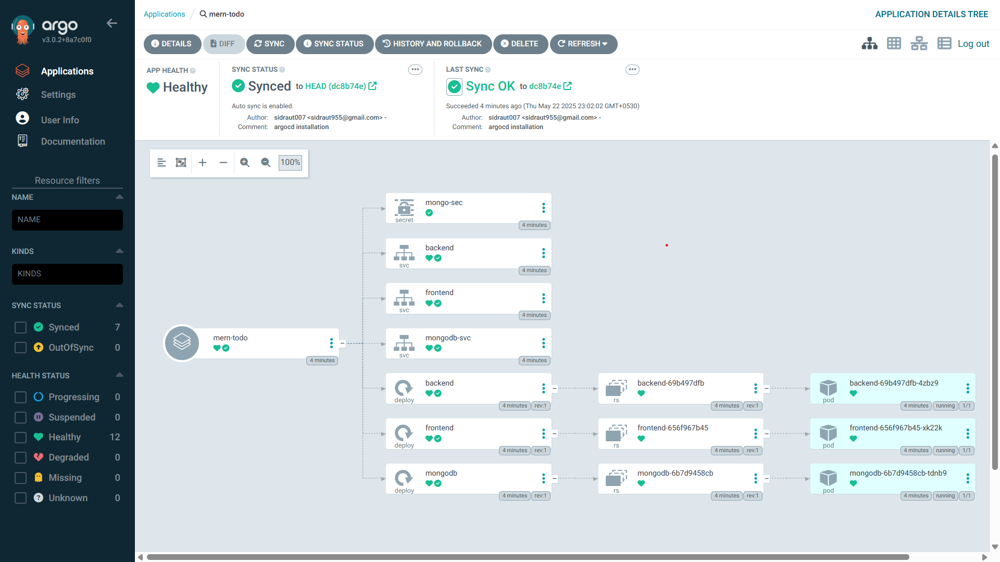
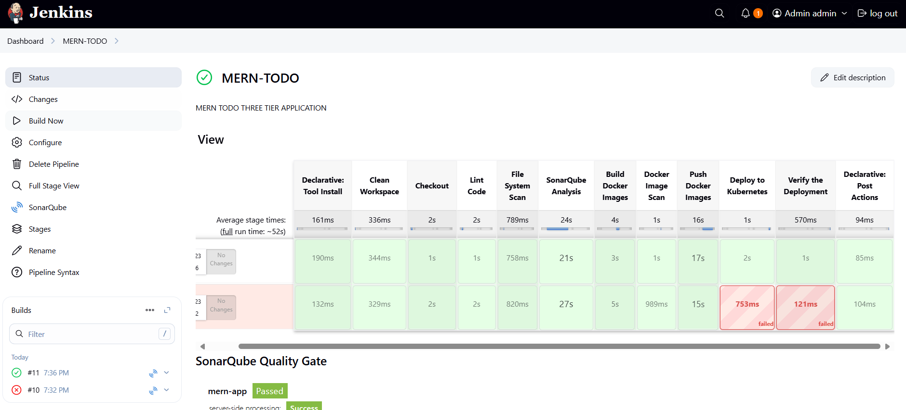

# MERN TODO DevSecops Implementation
- A TODO application is a simple yet powerful productivity tool that allows users to create, read, update, and delete (CRUD) tasks or items they need to accomplish. It serves as a practical project to demonstrate the integration of various technologies and practices — from frontend development to backend APIs, databases, and DevSecOps principles.


## Project Directory Structure

```bash
    MERN-TODO-APP/
    ├── backend/
    │   ├── Dockerfile
    │   └── ...
    ├── frontend/
    │   ├── Dockerfile
    │   └── ...
    ├── k8s/
    │   ├── frontend-deployment.yaml
    │   ├── backend-deployment.yaml
    │   └── ...
    ├── pipeline/
    │   └── CI/Jenkinsfile
    │   └── CI-CD/Jenkinsfile
    ├── sonar-project.properties
    └── docker-compose.yaml (for local dev)
```
---
## Pipeline Stages Structure

```bash
Checkout
  ↓
Lint
  ↓
File System Scan
  ↓
Install Dependencies
  ↓
Run Tests
  ↓
SonarQube Analysis
  ↓
Build Frontend (React)
  ↓
Build Docker Images
  ↓
Docker Image Scan
  ↓
Push Docker Images
  ↓
Deploy to Kubernetes (Optional)
  ↓
Post Actions

```
---
## 📝 Important:(When using Windows with Docker Desktop and kind cluster, your cluster runs inside a Docker)
  - If you're port-forwarding your frontend to localhost, you must also port-forward your backend service to localhost.
  - Otherwise, the frontend won't be able to communicate with the backend because it's still isolated inside the cluster.
  - Port-forwarding exposes services running inside the Kubernetes cluster to your local machine (localhost).
  - Without forwarding both services, your frontend (on localhost) won't be able to reach the backend (still inside the cluster network).

```bash
    # Port-forward the frontend service to localhost:80
    kubectl port-forward service/frontend 80:80

    # Port-forward the backend service to localhost:8080
    kubectl port-forward service/backend 8080:8080
```
---
## Argocd Installation:
  - Create argocd Namespace
  ```bash 
    kubectl create namespace argocd
    kubectl apply -n argocd -f https://raw.githubusercontent.com/argoproj/argo-cd/stable/manifests/install.yaml
    kubectl port-forward svc/argocd-server -n argocd 8000:443
  ```
  - Now you can access the Argo CD UI at: https://localhost:8000
  
  - Get Admin Password
    ```bash
      kubectl get secret argocd-initial-admin-secret -n argocd -o jsonpath="{.data.password}" | base64 -d
    ```
    
---
## Phase1_Create Vms
### Step 1: Sign in and Navigate to EC2
- Go to https://aws.amazon.com/console/ and sign in with your AWS account.
- In the AWS Management Console, search for "EC2" in the top bar and open the EC2 Dashboard.

### Step 2: Launch and Configure the Instance
- Click "Launch Instance", then:
- Select an Ubuntu AMI (e.g., Ubuntu Server 20.04 LTS).
- Choose an instance type (e.g., t2.micro for free-tier/testing).
- Proceed through the configuration options (network, storage, tags).
- You can keep the default settings unless specific changes are required.

### Step 3: Set Up Security Group and Launch
- Configure the Security Group:
- Add rules to allow access (e.g., SSH for port 22).
- Review all settings and click "Launch".
- Select an existing key pair or create a new one to access the instance.
- Click "Launch Instances" to complete the process.

### Step 4: Configure Security Group:
- In the "Step 6: Configure Security Group" section, configure the security group to allow SSH access (port 22) from your IP address.
- You may also want to allow other ports based on your requirements (e.g., HTTP, HTTPS) as in this pic Alt text

- Click "Review and Launch".

### Step 5: Review, Launch, and Access the Instance
- Review all the instance configuration settings and click "Launch".
- In the key pair dialog, choose an existing key pair or create a new one. Check the acknowledgment box and confirm the launch.
- Once the instance is running, use Mobaxterm to connect via SSH using your key pair and the public IP address of the instance.


### Step 6: Setup k8-cluster using Kubeadm
### Execute on Both "Master" & "Worker" Nodes
- Disable Swap: Required for Kubernetes to function correctly.
``` bash
sudo swapoff -a
```
- Load Necessary Kernel Modules: Required for Kubernetes networking.
```bash
cat <<EOF | sudo tee /etc/modules-load.d/k8s.conf
overlay
br_netfilter
EOF

sudo modprobe overlay
sudo modprobe br_netfilter
```
- Set Sysctl Parameters: Helps with networking.
``` bash
cat <<EOF | sudo tee /etc/sysctl.d/k8s.conf
net.bridge.bridge-nf-call-iptables  = 1
net.bridge.bridge-nf-call-ip6tables = 1
net.ipv4.ip_forward                 = 1
EOF

sudo sysctl --system
lsmod | grep br_netfilter
lsmod | grep overlay
```
- Install Containerd:
``` bash
sudo apt-get update
sudo apt-get install -y ca-certificates curl
sudo install -m 0755 -d /etc/apt/keyrings
sudo curl -fsSL https://download.docker.com/linux/ubuntu/gpg -o /etc/apt/keyrings/docker.asc
sudo chmod a+r /etc/apt/keyrings/docker.asc

echo "deb [arch=$(dpkg --print-architecture) signed-by=/etc/apt/keyrings/docker.asc] https://download.docker.com/linux/ubuntu $(. /etc/os-release && echo \"$VERSION_CODENAME\") stable" | sudo tee /etc/apt/sources.list.d/docker.list > /dev/null

sudo apt-get update
sudo apt-get install -y containerd.io

containerd config default | sed -e 's/SystemdCgroup = false/SystemdCgroup = true/' -e 's/sandbox_image = "registry.k8s.io\/pause:3.6"/sandbox_image = "registry.k8s.io\/pause:3.9"/' | sudo tee /etc/containerd/config.toml

sudo systemctl restart containerd
sudo systemctl status containerd
```
- Install Kubernetes Components:
``` bash
sudo apt-get update
sudo apt-get install -y apt-transport-https ca-certificates curl gpg

curl -fsSL https://pkgs.k8s.io/core:/stable:/v1.29/deb/Release.key | sudo gpg --dearmor -o /etc/apt/keyrings/kubernetes-apt-keyring.gpg

echo 'deb [signed-by=/etc/apt/keyrings/kubernetes-apt-keyring.gpg] https://pkgs.k8s.io/core:/stable:/v1.29/deb/ /' | sudo tee /etc/apt/sources.list.d/kubernetes.list

sudo apt-get update
sudo apt-get install -y kubelet kubeadm kubectl
sudo apt-mark hold kubelet kubeadm kubectl
```

### Execute ONLY on the "Master" Node
- Initialize the Cluster:
``` bash
sudo kubeadm init
```
- Set Up Local kubeconfig:
``` bash
mkdir -p "$HOME"/.kube
sudo cp -i /etc/kubernetes/admin.conf "$HOME"/.kube/config
sudo chown "$(id -u)":"$(id -g)" "$HOME"/.kube/config
```
- Install a Network Plugin (Calico):
```bash
kubectl apply -f https://raw.githubusercontent.com/projectcalico/calico/v3.26.0/manifests/calico.yaml
```
Generate Join Command:
```bash
kubeadm token create --print-join-command
```
Copy this generated token for next command.

### Execute on ALL of your Worker Nodes
- Perform pre-flight checks:
``` bash
sudo kubeadm reset pre-flight checks
```
- Paste the join command you got from the master node and append --v=5 at the end:
``` bash
sudo kubeadm join <private-ip-of-control-plane>:6443 --token <token> --discovery-token-ca-cert-hash sha256:<hash> --cri-socket 
"unix:///run/containerd/containerd.sock" --v=5
```
Note: When pasting the join command from the master node:

Add sudo at the beginning of the command
Add --v=5 at the end,
Example format:
``` bash
sudo <paste-join-command-here> --v=5
```
### Step 7: Installing Jenkins on Ubuntu
``` bash
#!/bin/bash

# Install OpenJDK 17 JRE Headless
sudo apt install openjdk-17-jre-headless -y

# Download Jenkins GPG key
sudo wget -O /usr/share/keyrings/jenkins-keyring.asc \
  https://pkg.jenkins.io/debian-stable/jenkins.io-2023.key

# Add Jenkins repository to package manager sources
echo deb [signed-by=/usr/share/keyrings/jenkins-keyring.asc] \
  https://pkg.jenkins.io/debian-stable binary/ | sudo tee \
  /etc/apt/sources.list.d/jenkins.list > /dev/null

# Update package manager repositories
sudo apt-get update

# Install Jenkins
sudo apt-get install jenkins -y
```
Save this script in a file, for example, install_jenkins.sh, and make it executable using:
``` bash
chmod +x install_jenkins.sh
```
Then, you can run the script using:
``` bash
./install_jenkins.sh
```
This script will automate the installation process of OpenJDK 17 JRE Headless and Jenkins.

- Install docker for future use
``` bash
#!/bin/bash

# Update package manager repositories
sudo apt-get update

# Install necessary dependencies
sudo apt-get install -y ca-certificates curl

# Create directory for Docker GPG key
sudo install -m 0755 -d /etc/apt/keyrings

# Download Docker's GPG key
sudo curl -fsSL https://download.docker.com/linux/ubuntu/gpg -o /etc/apt/keyrings/docker.asc

# Ensure proper permissions for the key
sudo chmod a+r /etc/apt/keyrings/docker.asc

# Add Docker repository to Apt sources
echo "deb [arch=$(dpkg --print-architecture) signed-by=/etc/apt/keyrings/docker.asc] https://download.docker.com/linux/ubuntu \
$(. /etc/os-release && echo "$VERSION_CODENAME") stable" | \
sudo tee /etc/apt/sources.list.d/docker.list > /dev/null

# Update package manager repositories
sudo apt-get update

sudo apt-get install -y docker-ce docker-ce-cli containerd.io docker-buildx-plugin docker-compose-plugin 
```
Save this script in a file, for example, install_docker.sh, and make it executable using:
``` bash
chmod +x install_docker.sh
```
Then, you can run the script using:
``` bash
./install_docker.sh
```
### Step 8: Setup Nexus
``` bash
#!/bin/bash

# Update package manager repositories
sudo apt-get update

# Install necessary dependencies
sudo apt-get install -y ca-certificates curl

# Create directory for Docker GPG key
sudo install -m 0755 -d /etc/apt/keyrings

# Download Docker's GPG key
sudo curl -fsSL https://download.docker.com/linux/ubuntu/gpg -o /etc/apt/keyrings/docker.asc

# Ensure proper permissions for the key
sudo chmod a+r /etc/apt/keyrings/docker.asc

# Add Docker repository to Apt sources
echo "deb [arch=$(dpkg --print-architecture) signed-by=/etc/apt/keyrings/docker.asc] https://download.docker.com/linux/ubuntu \
$(. /etc/os-release && echo "$VERSION_CODENAME") stable" | \
sudo tee /etc/apt/sources.list.d/docker.list > /dev/null

# Update package manager repositories
sudo apt-get update

sudo apt-get install -y docker-ce docker-ce-cli containerd.io docker-buildx-plugin docker-compose-plugin 
```
Save this script in a file, for example, install_docker.sh, and make it executable using:
``` bash
chmod +x install_docker.sh
```
Then, you can run the script using:
``` bash
./install_docker.sh
```
### Create Nexus using docker container
To create a Docker container running Nexus 3 and exposing it on port 8081, you can use the following command:
``` bash
docker run -d --name nexus -p 8081:8081 sonatype/nexus3:latest
```
This command does the following:
- -d: Detaches the container and runs it in the background.
- --name nexus: Specifies the name of the container as "nexus".
- -p 8081:8081: Maps port 8081 on the host to port 8081 on the container, allowing access to Nexus through port 8081.
- sonatype/nexus3:latest: Specifies the Docker image to use for the container, in this case, the latest version of Nexus 3 from the Sonatype repository.
After running this command, Nexus will be accessible on your host machine at http://IP:8081.
### Get Nexus initial password
Your provided commands are correct for accessing the Nexus password stored in the container. Here's a breakdown of the steps:
- Get Container ID: You need to find out the ID of the Nexus container. You can do this by running:
``` bash
docker ps
```
This command lists all running containers along with their IDs, among other information.
- Access Container's Bash Shell: Once you have the container ID, you can execute the docker exec command to access the container's bash shell:
``` bash
docker exec -it <container_ID> /bin/bash
```
Replace <container_ID> with the actual ID of the Nexus container.
- Navigate to Nexus Directory: Inside the container's bash shell, navigate to the directory where Nexus stores its configuration:
``` bash
cd sonatype-work/nexus3
```
- View Admin Password: Finally, you can view the admin password by displaying the contents of the admin.password file:
``` bash
cat admin.password
```
- Exit the Container Shell: Once you have retrieved the password, you can exit the container's bash shell:
``` bash
exit
```
This process allows you to access the Nexus admin password stored within the container. Make sure to keep this password secure, as it grants administrative access to your Nexus instance.

### Step 9: SetUp SonarQube
``` bash
#!/bin/bash

# Update package manager repositories
sudo apt-get update

# Install necessary dependencies
sudo apt-get install -y ca-certificates curl

# Create directory for Docker GPG key
sudo install -m 0755 -d /etc/apt/keyrings

# Download Docker's GPG key
sudo curl -fsSL https://download.docker.com/linux/ubuntu/gpg -o /etc/apt/keyrings/docker.asc

# Ensure proper permissions for the key
sudo chmod a+r /etc/apt/keyrings/docker.asc

# Add Docker repository to Apt sources
echo "deb [arch=$(dpkg --print-architecture) signed-by=/etc/apt/keyrings/docker.asc] https://download.docker.com/linux/ubuntu \
$(. /etc/os-release && echo "$VERSION_CODENAME") stable" | \
sudo tee /etc/apt/sources.list.d/docker.list > /dev/null

# Update package manager repositories
sudo apt-get update

sudo apt-get install -y docker-ce docker-ce-cli containerd.io docker-buildx-plugin docker-compose-plugin 
```
Save this script in a file, for example, install_docker.sh, and make it executable using:
``` bash
chmod +x install_docker.sh
```
Then, you can run the script using:
``` bash
./install_docker.sh
```
### Create Sonarqube Docker container
To run SonarQube in a Docker container with the provided command, you can follow these steps:
  1. Open your terminal or command prompt.
  2. Run the following command:
``` bash
docker run -d --name sonar -p 9000:9000 sonarqube:latest
```
This command will download the sonarqube:latest Docker image from Docker Hub if it's not already available locally. Then, it will create a container named "sonar" from this image, running it in detached mode (-d flag) and mapping port 9000 on the host machine to port 9000 in the container (-p 9000:9000 flag).

3. Access SonarQube by opening a web browser and navigating to http://<public-ip>:9000.

This will start the SonarQube server, and you should be able to access it using the provided URL. If you're running Docker on a remote server or a different port, replace localhost with the appropriate hostname or IP address and adjust the port accordingly.

---
## Phase2_Git-Repo-Setup
### Steps to create a private Git repository, generate a personal access token, connect to the repository, and push code to it:
### 1. Create a Private Git Repository:
- Go to your preferred Git hosting platform (e.g., GitHub, GitLab, Bitbucket).
- Log in to your account or sign up if you don't have one.
- Create a new repository and set it as private.
### 2. Generate a Personal Access Token:
- Navigate to your account settings or profile settings.
- Look for the "Developer settings" or "Personal access tokens" section.
- Generate a new token, providing it with the necessary permissions (e.g., repo access).
### 3. Clone the Repository Locally:
- Open Git Bash or your terminal.
- Navigate to the directory where you want to clone the repository.
- Use the git clone command followed by the repository's URL. For example:
``` bash
git clone <repository_URL>
```
Replace <repository_URL> with the URL of your private repository.
### 4. Add Your Source Code Files:
- Navigate into the cloned repository directory.
- Paste your source code files or create new ones inside this directory.
### 5. Stage and Commit Changes:
- Use the git add command to stage the changes:
``` bash
git add .
``` 
- Use the git commit command to commit the staged changes along with a meaningful message:
``` bash
git commit -m "Your commit message here"
```
### 6. Push Changes to the Repository:
- Use the git push command to push your committed changes to the remote repository:
``` bash
git push
```
- If it's your first time pushing to this repository, you might need to specify the remote and branch:
``` bash
git push -u origin master
```
Replace master with the branch name if you're pushing to a different branch.
### 7. Enter Personal Access Token as Authentication:
- When prompted for credentials during the push, enter your username (usually your email) and use your personal access token as the password.

By following these steps, you'll be able to create a private Git repository, connect to it using Git Bash, and push your code changes securely using a personal access token for authentication.

---

## Phase3_CICD
### Install Plugins in Jenkins
### 1. Eclipse Temurin Installer:
- This plugin enables Jenkins to automatically install and configure the Eclipse Temurin JDK (formerly known as AdoptOpenJDK).
- To install, go to Jenkins dashboard -> Manage Jenkins -> Manage Plugins -> Available tab.
- Search for "Eclipse Temurin Installer" and select it.
- Click on the "Install without restart" button.
### 2. Pipeline Maven Integration:
- This plugin provides Maven support for Jenkins Pipeline.
- It allows you to use Maven commands directly within your Jenkins Pipeline scripts.
### 3. Config File Provider:
- This plugin allows you to define configuration files (e.g., properties, XML, JSON) centrally in Jenkins.
- These configurations can then be referenced and used by your Jenkins jobs.
### 4. SonarQube Scanner:
- SonarQube is a code quality and security analysis tool.
- This plugin integrates Jenkins with SonarQube by providing a scanner that analyzes code during builds.
### 5. Kubernetes CLI:
- This plugin allows Jenkins to interact with Kubernetes clusters using the Kubernetes command-line tool (kubectl).
- It's useful for tasks like deploying applications to Kubernetes from Jenkins jobs.
### 6. Kubernetes:
- This plugin integrates Jenkins with Kubernetes by allowing Jenkins agents to run as pods within a Kubernetes cluster.
- It provides dynamic scaling and resource optimization capabilities for Jenkins builds.
### 7. Docker:
- This plugin allows Jenkins to interact with Docker, enabling Docker builds and integration with Docker registries.
- You can use it to build Docker images, run Docker containers, and push/pull images from Docker registries.
### 8. Docker Pipeline Step:
- This plugin extends Jenkins Pipeline with steps to build, publish, and run Docker containers as part of your Pipeline scripts.
- It provides a convenient way to manage Docker containers directly from Jenkins Pipelines.

### Pipeline
- ✅ Export the kubeconfig from your local machine
  - Run this command:
```bash
          kind get kubeconfig --name todo-devsecops > kind-kubeconfig.yaml
      ```
- ✅ Upload Kubeconfig to Jenkins

```bash
  Open Jenkins → Manage Jenkins → Credentials 
   ↓
  Select (global) or the relevant domain → click Add Credentials
   ↓
  Choose:
  Kind: Secret file
   ↓
  File: Upload the kind-kubeconfig.yaml you just exported
   ↓
  ID: k8s-cred
   ↓
  Description: KinD kubeconfig for MERN app
```
---

``` bash
pipeline {
    agent any

    tools {
        nodejs 'node18'
    }

    environment {
        SONAR_HOST_URL = 'http://sonarqube:9000'   //Update with your SonarQube URL
        SCANNER_HOME = tool 'sonar-scanner'
        DOCKER_IMAGE_FE = 'sidraut007/todo-frontend'
        DOCKER_IMAGE_BE = 'sidraut007/todo-backend'
        IMAGE_TAG = "${BUILD_NUMBER}"
    }

    stages {
        stage('Clean Workspace') {
            steps {
                echo '🧹 Cleaning up workspace...'
                cleanWs()
            }
        }

        stage('Checkout') {
            steps {
                echo 'Cloning the GitHub Repo...'
                git branch: 'main', url: 'https://github.com/sidraut007/MERN-TODO-APP.git'
            }
        }

        stage('Lint Code') {
            steps {
                dir('backend') {
                    sh 'npm run lint || true'
                }
                dir('frontend') {
                    sh 'npm run lint || true'
                }
            }
        }

        stage('File System Scan') {
            steps {
                sh 'trivy fs --scanners vuln --timeout 5m --format table -o trivy-fs-report.html .'
            }
        }

        stage('SonarQube Analysis') {
            steps {
                withSonarQubeEnv('sonar') {
                    sh '''
                        ${SCANNER_HOME}/bin/sonar-scanner \
                        -Dsonar.projectName=mern-app \
                        -Dsonar.projectKey=mern-app \
                        -Dsonar.sources=. \
                        -Dsonar.javascript.lcov.reportPaths=coverage/lcov.info
                    '''
                }
            }
        }

        /*stage('Install Dependencies') {
            steps {
                echo 'Installing backend dependencies...'
                dir('backend') {
                    sh 'npm install'
                }

                echo 'Installing frontend dependencies...'
                dir('frontend') {
                    sh 'npm install'
                }
            }
        }*/


        stage('Build Docker Images') {
            steps {
                sh """
                    docker build -t ${DOCKER_IMAGE_FE}:${IMAGE_TAG} ./frontend
                    docker build -t ${DOCKER_IMAGE_BE}:${IMAGE_TAG} ./backend
                """
            }
        }

        stage('Docker Image Scan') {
            steps {
                sh """
                    trivy image ${DOCKER_IMAGE_FE}:${IMAGE_TAG}
                    trivy image ${DOCKER_IMAGE_BE}:${IMAGE_TAG}
                """
            }
        }

        stage('Push Docker Images') {
            steps {
                script {
                    withDockerRegistry(credentialsId: 'docker-cred', toolName: 'docker') {
                        sh """    
                            docker push ${DOCKER_IMAGE_FE}:${IMAGE_TAG}
                            docker push ${DOCKER_IMAGE_BE}:${IMAGE_TAG}
                        """
                    }
                }
            }
        }

        stage('Deploy to Kubernetes') {
            steps {
                withKubeConfig(
                    credentialsId: 'k8s-cred',
                    namespace: 'workshop',
                    clusterName: 'kubernetes',
                    serverUrl: 'https://host.docker.internal:54450'  // Kubernetes API server as im using kind cluster so this is the url 
                ) {
                    dir('k8s/manifest/') {
                        sh '''
                        kubectl apply -f secret.yaml
                        kubectl apply -f .
                        '''
                    }
                }
            }
        }

        stage('Verify the Deployment') {
            steps {
                withKubeConfig(
                    credentialsId: 'k8s-cred',
                    namespace: 'workshop',
                    clusterName: 'kubernetes',
                    serverUrl: 'https://host.docker.internal:54450' // Kubernetes Controlplane/API server as im using kind cluster so this is the url 
                ) {
                    sh 'kubectl get pods -n workshop'
                    sh 'kubectl get svc -n workshop'
                }
            }
        }

    }

    post {
        success {
            echo '✅ Pipeline completed successfully.'
        }
        failure {
            echo '❌ Pipeline failed.'
        }
    }
}

```
---

## Phase4_Monitoring
### 1. Install Prometheus
- Download package using the Following command
``` bash 
wget https://github.com/prometheus/prometheus/releases/download/v3.4.0/prometheus-3.4.0.linux-amd64.tar.gz
```
-  Unzip the Package
``` bash
tar -xvf prometheus-3.4.0.linux-amd64.tar.gz
```
- Remove the zip file
``` bash
 rm -rf prometheus-3.4.0.linux-amd64.tar.gz
```
- Navigate to Prometheus 
``` bash
cd prometheus-3.4.0.linux-amd64
```
- Execute Prometheus
``` bash
./prometheus &
```
- Access the Prometheus web UI at
``` bash
http://<public-ip>:3000
```

### 2. Install Grafana
-  Run the following command 
``` bash
sudo apt-get install -y adduser libfontconfig1 musl
wget https://dl.grafana.com/enterprise/release/grafana-enterprise_12.0.0_amd64.deb
sudo dpkg -i grafana-enterprise_12.0.0_amd64.deb
```
- Access the Grafana web UI at
``` bash
http://<public-ip>:3000
```
### 3. Install Blackbox_exporter which help to monitor website 
- Download package
``` bash
wget https://github.com/prometheus/blackbox_exporter/releases/download/v0.26.0/blackbox_exporter-0.26.0.linux-amd64.tar.gz
```
- Unzip the Package
``` bash
tar -xvf blackbox_exporter-0.26.0.linux-amd64.tar.gz
```
- Remove the zip file
``` bash
 rm -rf blackbox_exporter-0.26.0.linux-amd64.tar.gz
```
- Navigate to blackbox_exporter 
``` bash
cd blackbox_exporter-0.26.0.linux-amd64
```
- Execute blackbox_exporter
``` bash
./blackbox_exporter &
```
- Access the Prometheus web using
``` bash
http://<public-ip>:9115
```
### 4. Configure Prometheus
- Navigate to your Prometheus folder:
``` bash
cd <prometheus-folder>
```
- Edit the prometheus.yml file and add the following configuration
``` bash
scrape_configs:
  - job_name: 'blackbox'
    metrics_path: /probe
    params:
      module: [http_2xx]  # Look for a HTTP 200 response.
    static_configs:
      - targets:
        - http://prometheus.io    # Target to probe with http.
        - http://example.com:8080 # Target to probe with http on port 8080.
    relabel_configs:
      - source_labels: [__address__]
        target_label: __param_target
      - source_labels: [__param_target]
        target_label: instance
      - target_label: __address__
        replacement: public-ip:9115  # The blackbox exporter's real hostname:port.
  - job_name: 'blackbox_exporter'  # collect blackbox exporter's operational metrics.
    static_configs:
      - targets: ['public-ip:9115']
```
Replace <public-ip> and <jenkins-ip> with your actual IP addresses.
- Restart prometheus
``` bash
pgrep prometheus
kill <id>
./prometheus &
```
- Open Grafana → Add Prometheus as a data source → Import dashboards for Blackbox and Node Exporter.
- Install Prometheus Metrics Plugin inside Jenkins and configure it to expose metrics at /prometheus.

### 5. Install node exporter on jenkins for system level Monitoring
- Run the following command on your Jenkins instance to start Node Exporter
``` bash
docker run -d \
  --net="host" \
  --pid="host" \
  -v "/:/host:ro,rslave" \
  quay.io/prometheus/node-exporter:latest \
  --path.rootfs=/host
  ```
- Access the Node Exporter web interface at
``` bash
http://<public-ip-jenkins>:9100
```
- Edit the prometheus.yml file in your Prometheus folder to include the following scrape jobs
``` bash
scrape_configs:
  - job_name: 'node_exporter'
    static_configs:
      - targets: ['jenkins-ip:9100']

  - job_name: 'jenkins'
    metrics_path: '/prometheus'
    static_configs:
      - targets: ['jenkins-ip:8080']
```
 Replace <jenkins-ip> with your actual Jenkins instance IP.
- Restart prometheus
``` bash
pgrep prometheus
kill <id>
./prometheus & 
```
- In Grafana:
Add a new dashboard ->
Choose Prometheus as the data source -> Import or create panels for system-level metrics (e.g., CPU, memory, disk, etc.) using Node Exporter data.

✅ Now you can visualize and monitor system metrics of your Jenkins instance using Grafana dashboards.